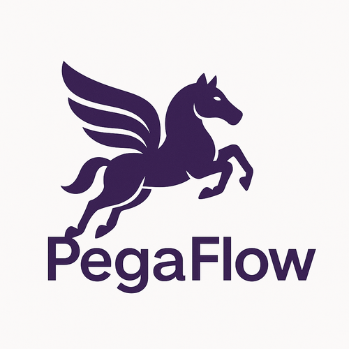

# Pegaflow

<div align="center">
  
  <p><em>Named after Pegasus, the winged horse of ancient myth — a creature born to cross impossible distances with effortless grace.</em></p>
</div>

PegaFlow is a **high-performance KV cache offloading solution** for LLM inference engines on single-node multi-GPU setups.

## What is PegaFlow?

PegaFlow enables efficient KV cache transfer and sharing for LLM inference workloads:

- **Single-node KV cache offloading** — offload KV cache to host memory and restore it back to GPU with minimal latency
- **Full parallelism support** — works with Pipeline Parallel (PP), Tensor Parallel (TP), and Data Parallel (DP)
- **Layer-wise transfer** — fine-grained, layer-by-layer KV cache operations for optimal memory utilization
- **P/D disaggregation** — separate prefill and decode phases across GPUs for better resource utilization
- **~9x TTFT improvement** — warm-start requests achieve dramatically lower time-to-first-token compared to cold-start

## Framework Integration

| Framework | Status | Link |
|-----------|--------|------|
| SGLang | 🚧 Under Review | [PR #17221](https://github.com/sgl-project/sglang/pull/17221) |

## Quick Start

### 1. Install

```bash
uv venv --prompt pegaflow
source .venv/bin/activate

uv pip install pegaflow-llm
```

> Hint for sglang users: If you running in sglang docker, you can create venv with `uv venv --prompt pegaflow --system-site-packages`.

### 2. Start Pegaflow Server

```bash
pegaflow-server
```

**All available options:**

- `--addr`: Bind address (default: `127.0.0.1:50055`)
- `--device`: CUDA device ID (default: `0`)
- `--pool-size`: Pinned memory pool size (default: `30gb`, supports: `kb`, `mb`, `gb`, `tb`)
- `--hint-value-size`: Hint for typical value size to tune cache and allocator (optional, supports: `kb`, `mb`, `gb`, `tb`)
- `--use-hugepages`: Use huge pages for pinned memory (default: `false`, requires pre-configured `/proc/sys/vm/nr_hugepages`)
- `--disable-lfu-admission`: Disable TinyLFU cache admission, fallback to plain LRU (default: `false`)
- `--metrics-otel-endpoint`: OTLP metrics export endpoint (default: `http://127.0.0.1:4321`, empty to disable)
- `--metrics-period-secs`: Metrics export period in seconds (default: `5`)
- `--log-level`: Log level: `trace`, `debug`, `info`, `warn`, `error` (default: `info`)
- `--ssd-cache-path`: Enable SSD cache by providing cache file path (optional)
- `--ssd-cache-capacity`: SSD cache capacity (default: `512gb`, supports: `kb`, `mb`, `gb`, `tb`)
- `--ssd-write-queue-depth`: SSD write queue depth, max pending write batches (default: `8`)
- `--ssd-prefetch-queue-depth`: SSD prefetch queue depth, max pending prefetch batches (default: `2`)

### 3. Connect to Server with client

#### Sglang:

example 1:

```bash
python3 -m sglang.launch_server --model-path Qwen/Qwen3-0.6B --served-model-name Qwen/Qwen3-0.6B --trust-remote-code --enable-cache-report --page-size 256 --host "0.0.0.0" --port 8000 --mem-fraction-static 0.8 --max-running-requests 32 --enable-pegaflow
```

example 2:

```bash
python3 -m sglang.launch_server --model-loader-extra-config "{\"enable_multithread_load\": true, \"num_threads\": 64}"  --model-path deepseek-ai/DeepSeek-V3.2 --served-model-name deepseek-ai/DeepSeek-V3.2 --trust-remote-code --page-size "64" --reasoning-parser deepseek-v3 --tool-call-parser deepseekv32 --enable-cache-report --host "0.0.0.0" --port 8031 --mem-fraction-static 0.83 --max-running-requests 64 --tp-size "8" --enable-pegaflow
```

#### vLLM:

```bash
vllm serve Qwen/Qwen3-0.6B --trust-remote-code --kv-transfer-config '{"kv_connector": "PegaKVConnector", "kv_role": "kv_both", "kv_connector_module_path": "pegaflow.connector", "kv_connector_extra_config": {"pegaflow.host": "http://127.0.0.1", "pegaflow.port": 50055}}'
```

## Development

### Build from source

```bash
# Set environment variables for PyO3
export PYO3_PYTHON=$(which python)
export LD_LIBRARY_PATH=$(python -c "import sysconfig; print(sysconfig.get_config_var('LIBDIR'))"):$LD_LIBRARY_PATH

# Start the server with defaults (127.0.0.1:50055, device 0, 30gb pool)
cargo run -r
```

Additional args:

**Customize pool size** (if needed):

```bash
cargo run -r -- --pool-size 50gb
```

**Enable debug logging** to see internal state and detailed operation logs:

```bash
# Option 1: Use --log-level flag
cargo run -r -- --log-level debug

# Option 2: Use RUST_LOG environment variable for fine-grained control
RUST_LOG=debug cargo run -r
RUST_LOG=info,pegaflow_core=debug cargo run -r  # Debug core only
```

### 3. Build Python Bindings

```bash
cd python
maturin develop --release
cd ..
```

To build a wheel for the Python bindings (for distribution or local use):

```bash
cd python
maturin build --release
```

## Benchmarks

### KV Cache Benchmark

`examples/bench_kv_cache.py` automates a full TTFT-focused benchmark. Provide your checkpoint path (we test with Llama-3.1-8B on H800):

```bash
uv run python examples/bench_kv_cache.py \
  --model /path/to/your/Llama-3.1-8B \
  --num-prompts 10 \
  --input-len 4096 \
  --output-len 1 \
  --request-rate 1.0
```

H800 Reference Numbers

PegaFlow TTFT measurements from an H800 with Llama-3.1-8B (8 prompts, 10K-token prefill, 1-token decode, 4.0 req/s):

| Configuration   | TTFT mean (ms) | TTFT p99 (ms) |
| --------------- | -------------- | ------------- |
| PegaFlow (Cold) | 572.5          | 1113.7        |
| PegaFlow (Warm) | 61.5           | 77.0          |

The warm-start path achieves **~9x faster TTFT** compared to cold-start, demonstrating effective KV cache sharing across requests.

### vLLM Patch for Better I/O Performance

To maximize I/O throughput when using PegaFlow with vLLM, we recommend a small patch to vLLM's KV cache block allocation. Sorting block IDs ensures GPU memory addresses are as sequential and contiguous as possible, which improves DMA/RDMA transfer efficiency.

Upstream RFC: https://github.com/vllm-project/vllm/issues/31371

Locate the file `vllm/v1/core/kv_cache_utils.py` in your vLLM installation (e.g., `.venv/lib/python3.10/site-packages/vllm/v1/core/kv_cache_utils.py`), find the `append_n` method in the `FreeKVCacheBlockQueue` class, and add a sorting line:

```python
def append_n(self, blocks: list[KVCacheBlock]) -> None:
    """Put a list of blocks back into the free list

    Args:
        blocks: The blocks to append.
    """
    if len(blocks) == 0:
        return

    blocks.sort(key=lambda x: x.block_id)  # <-- Add this line
    last_block = self.fake_free_list_tail.prev_free_block
    ...
```

This simple change can noticeably reduce transfer latency by enabling more efficient memory access patterns during KV cache operations.

## P/D Disaggregation

PegaFlow supports Prefill/Decode (P/D) disaggregation, where prefill and decode phases run on separate GPU nodes. A lightweight router coordinates the flow: requests first go to P nodes for prefill (KV cache generation), then to D nodes for decode (token generation).

### Architecture

```
Client Request
      │
      ▼
   Router (:8000)
      │
      ├──► P Node (:8100) ─── prefill, generate KV cache ───┐
      │                                                     │
      │                                                     ▼
      │                                              PegaEngine Server
      │                                            (centralized KV store)
      │                                                     │
      └──► D Node (:8200) ◄─── load KV cache ───────────────┘
               │
               ▼
        Response to Client
```

### Benchmark Results (H800, Qwen3-8B, 5K input tokens)

| Configuration  | TTFT mean (ms) | TPOT mean (ms) | TPOT p99 (ms) | ITL p99 (ms) |
| -------------- | -------------- | -------------- | ------------- | ------------ |
| P/D (1P+1D)    | 573.78         | 15.68          | 15.89         | 21.71        |
| Baseline (DP2) | 438.24         | 22.67          | 24.32         | 142.70       |

P/D disaggregation trades higher TTFT for **significantly more stable decode latency** — TPOT p99 drops from 24.32ms to 15.89ms, and ITL p99 improves dramatically from 142.70ms to 21.71ms.

## Goals

1. **A Data Path Purpose-Built for LLM Inference**

   Focus exclusively on the typical data flows in large model inference: data movement between prefill and decode phases, between different compute roles, and high-throughput transport of weights and KV/activations. We only solve this specific class of problems—high-bandwidth, predictable, structured data paths.

2. **RDMA-First, High-Performance Implementation**

   The initial version prioritizes RDMA, leveraging static topology, long-lived connections, and pre-allocated resources to push throughput, stability, and tail latency close to hardware limits—validating the value of a "dedicated transport layer".

3. **Developer-Friendly Abstractions**

   Provide clear, minimal transport semantics and channel models: easy to understand, simple to integrate, and predictable in behavior. Avoid hidden policies that cause mysterious performance jitter, allowing users to make confident performance assumptions.

4. **Built-In Observability and Tunability**

   Export key metrics and debugging information from day one (throughput, latency distribution, resource utilization, error signals, etc.), giving cluster operators data to guide topology and parameter tuning—rather than black-box trial-and-error.

5. **Embeddable in Existing Inference Systems**

   Serve as an optional "transport backend" that can plug into existing inference/dispatch/scheduling components—without requiring a full rewrite of the upper layers—ensuring the PoC can be validated quickly in real production stacks.

## Non-Goals

1. **Not a General-Purpose RPC or Service Framework**

   No request routing, load balancing, IDL, or serialization format wars—these concerns belong to upper layers or other projects.

2. **Not a Universal Network Virtualization Layer**

   No attempt to automatically adapt to all network environments, cloud providers, or dynamic topologies; the initial focus is deep optimization for known, controlled, performance-sensitive clusters.

3. **Not a Full-Featured Communication Middleware**

   Does not cover collectives, group communication semantics, or a comprehensive flow control ecosystem—only focused on high-value point-to-point (or few-node) bulk transfer scenarios.

4. **Not a "Runs Everywhere" Compatibility Solution**

   No compromising design sharpness for compatibility with low-spec or non-accelerated network environments; other protocols or software fallbacks are incremental extensions, not core promises.

5. **Not a Security or Compliance Component**

   No built-in complex authentication, encryption, or multi-tenant isolation; default assumption is deployment in controlled environments, with security handled by infrastructure.
